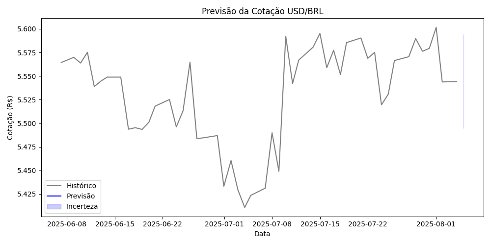
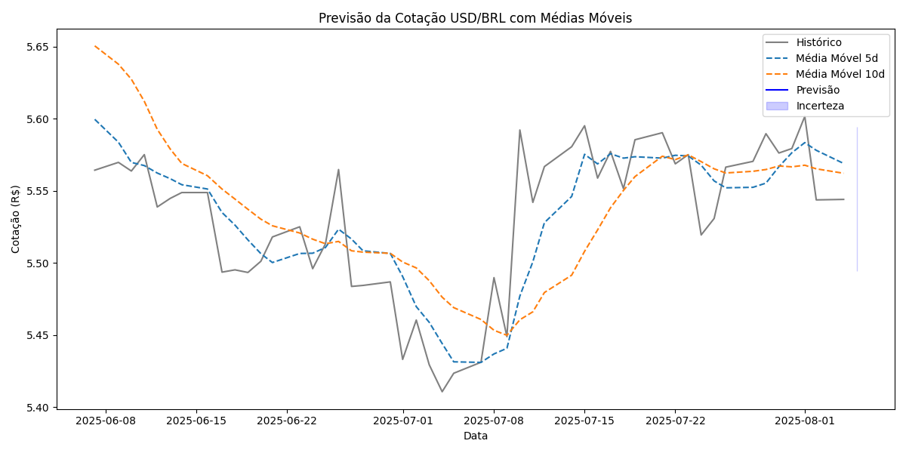
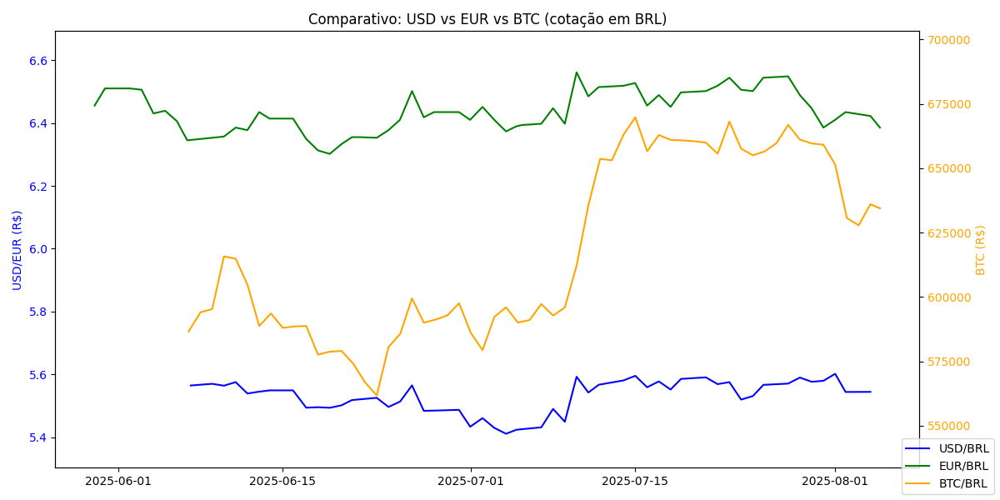

# Previsão da Cotação USD/BRL com Aprendizado de Máquina

Este projeto realiza a previsão da cotação do dólar (USD/BRL) para o próximo dia útil utilizando dados históricos obtidos via API pública e um modelo de **Regressão Linear com memória**. Todo o pipeline — coleta, transformação, modelagem, previsão e geração de relatório — é automatizado.

O modelo é salvo localmente após o primeiro treino e **reutilizado nas execuções futuras**, evitando a necessidade de reprocessamento e permitindo maior eficiência.

---

## O que o projeto faz

### 1. Coleta dados reais de mercado
- Obtém os últimos **60 dias** de cotações USD/BRL usando a [AwesomeAPI](https://docs.awesomeapi.com.br/api-de-moedas).
- Salva o histórico bruto e gera um CSV organizado com as cotações diárias.
- **Script:** `coletar_dados.py`

### 2. Realiza transformação e engenharia de atributos
- Converte timestamps para datas legíveis.
- Calcula variáveis técnicas para alimentar o modelo:
  - Média móvel de 5 dias (`media_movel_5d`)
  - Média móvel de 10 dias (`media_movel_10d`)
  - Valor da venda no próximo dia (`venda_amanha`)
- **Script:** `transformar_dados.py`

### 3. Treina e reutiliza modelo de Regressão Linear
- Utiliza `venda`, `media_movel_5d` e `media_movel_10d` como variáveis preditoras.
- Treina um modelo com `scikit-learn` e **salva o modelo** (`.pkl`) para uso futuro.
- Se o modelo já existir, ele é reutilizado, evitando retreinamento desnecessário.
- Avaliado com:
  - R² (coeficiente de determinação)
  - MSE (erro quadrático médio)
- **Script:** `modelar_previsao.py`

### 4. Gera previsões e relatórios
- Faz a previsão do dólar para o **próximo dia útil**.
- Cria gráficos salvos em `.png` com:
  - Histórico de preços
  - Faixa de incerteza da previsão
  - Comparativo com outros ativos (como Euro, Bitcoin, Ibovespa)
- Gera relatório `.pdf` com a previsão mais recente.
- **Script:** `relatorio.py`

---

## Estrutura de pastas

previsao_dolar/
├── output/ # Arquivos gerados (gráficos, modelo, CSV)
│ ├── grafico_previsao.png
│ ├── grafico_previsao_completo.png
│ ├── grafico_comparativo_ativos.png
│ ├── histograma_variacao.png
│ ├── previsao_usdbrl.csv
│ └── modelo_usd.pkl # Modelo salvo (memória do sistema)
│
├── relatorios/ # Relatórios finais em PDF
│
├── coletar_dados.py
├── transformar_dados.py
├── modelar_previsao.py
├── relatorio.py
├── main.py # Executa o pipeline completo
├── requirements.txt
├── README.md

## Exemplos de saída

- **Previsão do dólar para amanhã:** R$ 5.5445  
- **Gráficos gerados:**

📌 Histórico com previsão:  


📌 Previsão completa com banda de incerteza:  


📌 Comparativo entre ativos (USD vs Euro, Bitcoin, Ibovespa):  


---

## Como executar

1. Clone o projeto:
   ```bash
   git clone https://github.com/seuusuario/previsao_dolar.git
   cd previsao_dolar

   pip install -r requirements.txt
   python main.py
